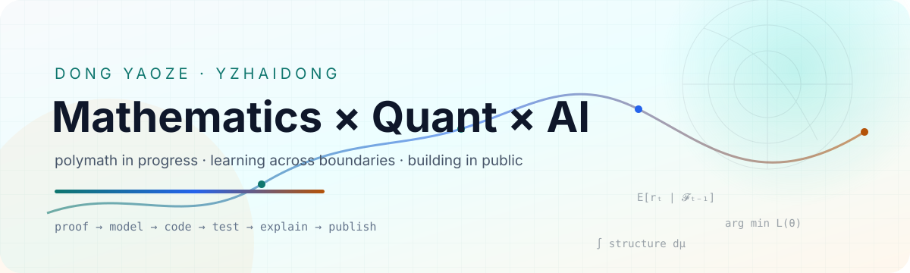

<!-- Profile README for github.com/DongYaoZe -->

<picture>
  <source media="(prefers-color-scheme: dark)" srcset="./assets/banner-dark.svg">
  <source media="(prefers-color-scheme: light)" srcset="./assets/banner-light.svg">
  
</picture>

  
  
  
  

  

## `01 / About` · 关于我

<table>
<tr>
<td width="50%" valign="top">

### 中文

我是 **yzhaidong**，南京大学匡亚明学院 2025 级本科生。

我希望成为一个 **Polymath（通识者）**：以数学为底层语言，在量化金融、人工智能与大理科之间建立连接，再把理解沉淀为代码、讲义和开放资料。

- 探索数学、量化金融与人工智能的交叉地带
- 编写清晰、可复现的课程资料与书籍习题解答
- 用 LaTeX、程序和实验把抽象想法变成可分享的成果

</td>
<td width="50%" valign="top">

### English

I'm **yzhaidong**, a Class of 2025 undergraduate at Kuang Yaming Honors School, Nanjing University.

I aspire to be a **polymath**: using mathematics as a common language to connect quantitative finance, artificial intelligence, and the natural sciences—then turning what I learn into code, notes, and open resources.

- Exploring the intersection of mathematics, quant finance, and AI
- Writing reproducible learning resources and textbook solutions
- Turning abstract ideas into shareable work with LaTeX and code

</td>
</tr>
</table>

> **Current coordinates:** mathematical foundations · quantitative research · AI experiments · open knowledge

## `02 / Toolkit` · 技术与工具

  

  
  
  
  

## `03 / Selected Work` · 代表项目

<table>
<tr>
<td width="50%" valign="top">

### [数学分析讲义习题解答](https://github.com/DongYaoZe/math-analysis-lectures-solutions-USTC)

中科大《数学分析讲义》全三册的非官方课后习题详细解答。

`Mathematical Analysis` `LaTeX` `Open Education`

</td>
<td width="50%" valign="top">

### [Linear Algebra Done Wrong 中文翻译](https://github.com/DongYaoZe/Translate-LADW)

将 Sergei Treil 的英文线性代数教材翻译为中文，让优质数学内容更易抵达。

`Linear Algebra` `Translation` `Open Book`

</td>
</tr>
<tr>
<td width="50%" valign="top">

### [Gomoku Lab](https://github.com/DongYaoZe/gomoku-lab)

集成 Minimax、MCTS 与 AlphaZero 的五子棋博弈实验平台。

`C++` `Game AI` `Reinforcement Learning`

</td>
<td width="50%" valign="top">

### [Polymath Project](https://github.com/DongYaoZe/polymath-project)

以 AI 时代的跨学科学习为实验场，系统探索大学课程与知识连接。

`Interdisciplinary` `Learning in Public` `Knowledge`

</td>
</tr>
<tr>
<td width="50%" valign="top">

### [化学原理习题解答](https://github.com/DongYaoZe/chemical-principles-solutions)

为高教社《化学原理》编写排版精良、解析详尽的非官方参考答案。

`Chemistry` `LaTeX` `Solutions`

</td>
<td width="50%" valign="top">

### [大学物理学习题解答](https://github.com/DongYaoZe/university-physics-solutions)

卢德馨《大学物理学》的非官方课后习题详细解答。

`Physics` `LaTeX` `Open Education`

</td>
</tr>
</table>

## `04 / Signals` · GitHub 足迹

  
  

<b>展开贡献轨迹 · Contribution snake</b>

 
<picture>
  <source media="(prefers-color-scheme: dark)" srcset="https://raw.githubusercontent.com/DongYaoZe/DongYaoZe/output/github-contribution-grid-snake-dark.svg">
  <source media="(prefers-color-scheme: light)" srcset="https://raw.githubusercontent.com/DongYaoZe/DongYaoZe/output/github-contribution-grid-snake.svg">
  
</picture>

---

  <i>Measure carefully. Learn broadly. Build openly.</i> 
  谨慎度量，广泛求知，开放创造。

