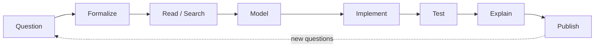
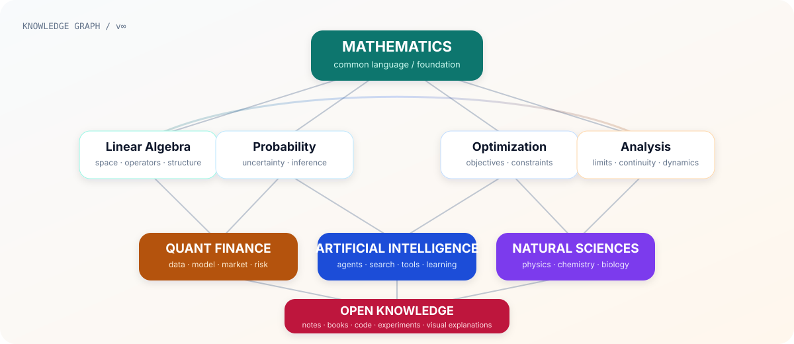

<!-- Profile README for github.com/DongYaoZe -->

<p align="center">
  <picture>
    <source media="(prefers-color-scheme: dark)" srcset="./assets/banner-dark.svg">
    <source media="(prefers-color-scheme: light)" srcset="./assets/banner-light.svg">
    
  </picture>
</p>

<p align="center">
  <a href="mailto:yzhaidong@gmail.com"></a>
  <a href="https://x.com/zzzzzzahi"></a>
  <a href="https://b23.tv/1ZWbj8o"></a>
  
</p>

<p align="center">
  <strong>Mathematics × Quantitative Finance × Artificial Intelligence</strong><br>
  <sub>polymath in progress · learning across boundaries · building in public</sub>
</p>

<p align="center">
  <code>proof → model → code → test → explain → publish</code>
</p>

---

## `01 / Coordinates` · 关于我

### 中文

我是 **yzhaidong / 董耀择**，南京大学匡亚明学院 2025 级本科生。

我希望成为一个真正意义上的 **Polymath（通识者）**：以数学作为底层语言，把量化金融、人工智能与自然科学连接起来，再把理解沉淀为可复现的代码、讲义、实验与开放资料。

我尤其喜欢处理这几类问题：

- 把抽象数学结构变成可计算、可验证的对象；
- 把课程知识整理成真正能被别人继续使用的材料；
- 把 AI 当作研究与学习的放大器，而不是黑箱答案机；
- 在不同学科之间寻找可以迁移的方法、模型与直觉。

### English

I'm **yzhaidong**, a Class of 2025 undergraduate at Kuang Yaming Honors School, Nanjing University.

I use mathematics as a common language across **quantitative finance, artificial intelligence, and the natural sciences**, then turn what I learn into reproducible code, notes, books, and experiments.

```text
foundation   → mathematics
research     → quantitative finance
engineering  → AI-assisted workflows
exploration  → natural sciences
output       → code · notes · books · experiments
principle    → clarity · reproducibility · openness
```

> **Current coordinates:** mathematical foundations · quantitative research · AI systems · open knowledge · interdisciplinary exploration

---

## `02 / Current Focus` · 当前关注

<p align="center">
  
  
  
  
</p>

| Track | What I care about |
|---|---|
| **Mathematical foundations** | analysis, linear algebra, probability, optimization, proof and abstraction |
| **Quantitative research** | derivatives, systematic research, data pipelines, backtesting, risk-aware modeling |
| **AI systems** | agentic workflows, tools, retrieval, evaluation, reproducible human–AI collaboration |
| **Open learning** | high-quality notes, textbook solutions, translation, visual knowledge structures |
| **Polymath exploration** | chemistry, biology, physics and the transferable structures behind them |

---

## `03 / Research OS` · 我怎样做学习与研究



我倾向于把学习和研究都做成一个闭环：**问题 → 形式化 → 查证 → 建模 → 实现 → 测试 → 解释 → 公开沉淀**。

这也是为什么我的仓库里会同时出现数学证明、LaTeX 书稿、AI 实验、课程资料、数据管线和可视化项目。对我而言，它们不是互不相关的收藏，而是同一套学习系统在不同学科中的实例。

---

## `04 / Selected Work` · 代表项目

<table>
<tr>
<td width="50%" valign="top">

### 📘 [数学分析讲义习题解答](https://github.com/DongYaoZe/math-analysis-lectures-solutions-USTC)

中科大《数学分析讲义》全三册的非官方课后习题详细解答。

`Mathematical Analysis` `LaTeX` `Open Education`

</td>
<td width="50%" valign="top">

### 📗 [Linear Algebra Done Wrong 中文翻译](https://github.com/DongYaoZe/Translate-LADW)

将 Sergei Treil 的线性代数教材翻译为中文，让优质数学内容更易抵达。

`Linear Algebra` `Translation` `Open Book`

</td>
</tr>
<tr>
<td width="50%" valign="top">

### ♟️ [Gomoku Lab](https://github.com/DongYaoZe/gomoku-lab)

集成 Minimax、MCTS 与 AlphaZero 的五子棋博弈实验平台。

`C++` `Game AI` `Reinforcement Learning`

</td>
<td width="50%" valign="top">

### 🧭 [Polymath Project](https://github.com/DongYaoZe/polymath-project)

以 AI 时代的跨学科学习为实验场，系统探索大学课程、知识依赖与学科连接。

`Interdisciplinary` `Learning in Public` `Knowledge Graph`

</td>
</tr>
<tr>
<td width="50%" valign="top">

### ⚗️ [化学原理习题解答](https://github.com/DongYaoZe/chemical-principles-solutions)

为高教社《化学原理》编写排版精良、解析详尽的非官方参考答案。

`Chemistry` `LaTeX` `Solutions`

</td>
<td width="50%" valign="top">

### 🌌 [大学物理学习题解答](https://github.com/DongYaoZe/university-physics-solutions)

卢德馨《大学物理学》的非官方课后习题详细解答。

`Physics` `LaTeX` `Open Education`

</td>
</tr>
</table>

---

## `05 / Signals` · GitHub 足迹

<p align="center">
  <picture>
    <source media="(prefers-color-scheme: dark)" srcset="./assets/github-stats-dark.svg">
    <source media="(prefers-color-scheme: light)" srcset="./assets/github-stats.svg">
    
  </picture>
  <picture>
    <source media="(prefers-color-scheme: dark)" srcset="./assets/top-langs-dark.svg">
    <source media="(prefers-color-scheme: light)" srcset="./assets/top-langs.svg">
    
  </picture>
</p>

<sub>These cards are generated periodically by GitHub Actions and committed back into this repository. The profile no longer depends on the public github-readme-stats Vercel endpoint at page-render time.</sub>

---

## `06 / Knowledge Map` · 知识地图

<p align="center">
  <picture>
    <source media="(prefers-color-scheme: dark)" srcset="./assets/knowledge-map-dark.svg">
    <source media="(prefers-color-scheme: light)" srcset="./assets/knowledge-map-light.svg">
    
  </picture>
</p>

> 我更关心“这些课程和领域为什么连在一起”，而不只是“我学过哪些课程”。知识地图会随着理解继续重构。

---

## `07 / Toolkit` · 工具箱

<p align="center">
  <picture>
    <source media="(prefers-color-scheme: dark)" srcset="https://skillicons.dev/icons?i=c,cpp,py,ts,latex,git,github,vscode&theme=dark&perline=8">
    <source media="(prefers-color-scheme: light)" srcset="https://skillicons.dev/icons?i=c,cpp,py,ts,latex,git,github,vscode&theme=light&perline=8">
    
  </picture>
</p>

### Think

`proof & abstraction` · `modeling` · `numerical reasoning` · `research design` · `cross-disciplinary synthesis`

### Build

`Python / C / C++` · `TypeScript` · `LaTeX` · `Git / GitHub` · `automation & agents`

### Ship

`reproducible notes` · `textbook solutions` · `research pipelines` · `visual explanations` · `open educational resources`

---

## `08 / Contributions` · 贡献轨迹

<p align="center">
  <picture>
    <source media="(prefers-color-scheme: dark)" srcset="./assets/contribution-snake-dark.svg">
    <source media="(prefers-color-scheme: light)" srcset="./assets/contribution-snake.svg">
    
  </picture>
</p>

<sub>The animation is generated by GitHub Actions and stored directly in this repository, avoiding a separate output branch and third-party image host.</sub>

---

## `09 / Principles` · 一些长期原则

### 01 · Inspectability

**Do not optimize for appearing knowledgeable. Optimize for becoming inspectably correct.** 让推导、数据来源、假设和失败路径都能被重新检查。

### 02 · Reproducibility

如果一个结论只能存在于某次对话、某台电脑或某个偶然环境里，它还没有真正成为知识。让别人——也让未来的自己——能够接着做。

### 03 · Connection

跨学科不是把名词堆在一起，而是寻找真正可迁移的结构：线性、随机性、优化、反馈、尺度与信息。

---

## `10 / Contact`

<p align="center">
  <strong>Ideas, corrections, collaboration, or an interesting problem are all welcome.</strong><br><br>
  <a href="mailto:yzhaidong@gmail.com">Email</a>
  ·
  <a href="https://x.com/zzzzzzahi">X</a>
  ·
  <a href="https://b23.tv/1ZWbj8o">Bilibili</a>
  ·
  <a href="https://github.com/DongYaoZe?tab=repositories">Repositories</a>
</p>

<p align="center">
  <i>Measure carefully. Learn broadly. Build openly.</i><br>
  <sub>Mathematics gives structure. Code gives experiments. Writing makes the structure inspectable.</sub>
</p>
